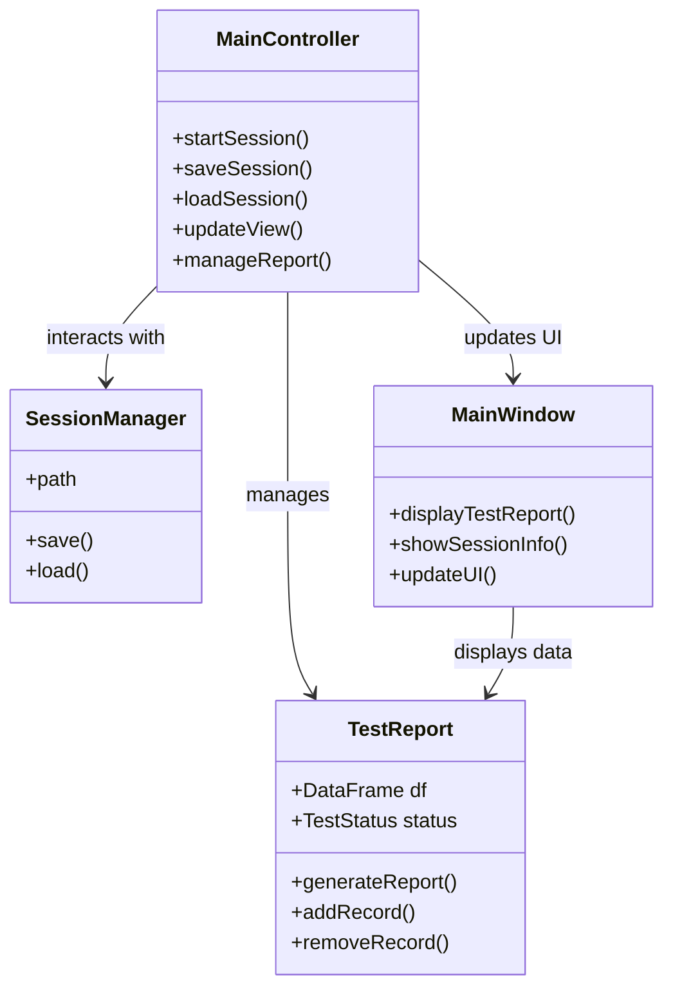

# Test Report Generator

The **Test Report Generator** application is designed to manage, report, and visualize test results. This application follows the **Model-View-Controller (MVC)** architecture, effectively separating the core functionality into three primary components:

* **Model**: Manages data, including test reports and session information.
* **View**: Provides the user interface (UI) for interacting with and displaying the data.
* **Controller**: Handles user interactions, updates the model, and manages the flow between the model and the view.

This application enables users to:

* Load, view, and manage test reports.
* Generate and export detailed PDF reports for documentation.
* Save and load test sessions, preserving the application's state.

Built using **PySide6**, this project offers a rich graphical interface for interacting with the test data.

## Project Structure

```plaintext
controller/
    └── main_controller.py      # Main controller handling logic and interactions between model and view
model/
    └── report.py               # Defines the TestReport model to store and manipulate test data
    └── session.py              # Manages session saving and loading from a JSON file
view/
    └── widgets.py              # Contains UI components (windows, tables, forms, buttons, etc.)
reports/
    └── pdf_builder.py          # Builds PDF reports from test data
    └── pdf_config.py           # Configuration for PDF styling and layout
main.py                        # Main entry point to run the application
config/                        # Configuration files for session management and settings
```

## Core Components

### 1. **Model**

The **Model** is responsible for handling the data and business logic of the application. It includes:

* **TestReport**: A class that stores test results in a `pandas.DataFrame`. It provides methods to manipulate and generate statistics for reports.
* **SessionManager**: A class that handles saving and loading session data to/from a JSON file. It allows preserving the state of the application between sessions.

### 2. **View**

The **View** is responsible for displaying the data to the user through various interface components:

* **Widgets**: The user interface components (e.g., tables, buttons, forms) are defined using PySide6 widgets. The `view/widgets.py` file contains the code for these UI components, allowing users to interact with and view the data (e.g., test reports and session information).

### 3. **Controller**

The **Controller** mediates the interaction between the **Model** and the **View**. It listens to user input, updates the model, and refreshes the view accordingly. The `MainController` class, located in `controller/main_controller.py`, is the heart of the controller logic, managing the flow between the other components.

* It handles user interactions, such as button clicks and data entry.
* It updates the view with the latest data and handles any changes made by the user.
* It interacts with the model to load/save session data and generate reports.




## Features

* **Test Report Management**: Create and view test reports with results (Pass, Fail, Not Tested).
* **Session Management**: Load and save test sessions, preserving the application's state.
* **PDF Report Generation**: Generate detailed PDF reports for tests, formatted with tables, images, and other visual components.
* **Interactive GUI**: A user-friendly interface built with PySide6 for managing reports and sessions.

## Requirements

To run the project, you'll need Python 3.7+ and the following dependencies:

* PySide6
* pandas
* matplotlib
* reportlab

These dependencies can be installed using the `requirements.txt` file:

```bash
pip install -r requirements.txt
```

Alternatively, you can install the dependencies manually using:

```bash
pip install PySide6 pandas matplotlib reportlab
```

## Usage

1. Clone the repository and navigate to the project directory:

```bash
git clone <repository_url>
cd <project_directory>
```

2. Install the required dependencies:

```bash
pip install -r requirements.txt
```

3. Run the `main.py` file to start the application:

```bash
python main.py
```

4. The application will launch, providing the following features:

   * View test reports.
   * Load and save test sessions.
   * Generate and export PDF reports.

## Configuration

The application stores session data in a configuration directory:

```
~/.config/test_dashboard/test_dashboard_session.json
```

Make sure the necessary directories are available for saving and loading session data.

## MVC Architecture

The application is built following the **Model-View-Controller (MVC)** design pattern:

* **Model**:

  * The `model/` directory includes the `TestReport` class (which manages the test data) and the `SessionManager` class (which handles session loading and saving).
* **View**:

  * The `view/` directory contains all the UI components (widgets) that present data to the user and allow interaction. The UI is built using PySide6 (Qt for Python).
* **Controller**:

  * The `controller/` directory contains the `MainController` class, which manages the flow of the application. It listens to user interactions and updates both the view and the model accordingly.

## PDF Report Generation

The application supports generating test reports in PDF format. This is handled by `reports/pdf_builder.py`, which uses the `reportlab` library to create professionally formatted PDFs. The styling and layout of the PDF reports can be customized through the `reports/pdf_config.py` file.
